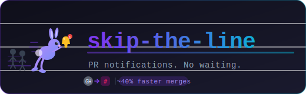
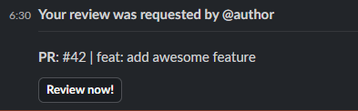
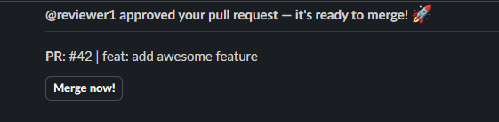
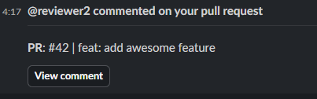

[](https://github.com/lays147/skip-the-line/actions/workflows/ci.yml)



Skip The Line is a GitHub webhook service that delivers real-time Slack DMs for pull request activity — so reviewers never miss a review request and authors always know the moment someone approves or leaves feedback.

No more pinging coworkers to look at your PR. No more refreshing GitHub to see if anyone has reviewed it. Your team gets a direct message, exactly when it matters.

> By using this service your organization may reduce Mean Time to Merge (MTTM) by around **40%**.

## What it does

**New review request** — when a PR is assigned for review, the reviewer gets a Slack DM with a direct link.



**Review submitted** — when a reviewer approves or requests changes, the PR author receives a Slack DM.



**Comment posted** — when someone comments on a PR, the author is notified via Slack DM.



## How it works

```
GitHub webhook → HMAC signature validation → event routing → subscriber resolution → Slack DM
```

GitHub sends a signed webhook payload to this service. The service validates the signature, routes the event by type and action, resolves the relevant recipients from a subscriber registry, and sends each one a Slack DM.

## How to Deploy

Check [Deployment.md](./Deployment.md)

## Quickstart (local development)

**Requirements:** Go 1.26.1+, Docker, Docker Compose.

```bash
make up                # starts the app
```

The app is available at `http://localhost:8080`. See [CONTRIBUTING.md](CONTRIBUTING.md) for all available `make` targets and E2E testing instructions.

## Subscribers

The service maps GitHub usernames to Slack users via email. Add entries to `internal/subscription/subscriptions.yaml` before building:

```yaml
subscriptions:
  - github_username: octocat
    email: octocat@example.com
```

Users who pull the published image can supply the file at runtime via the `SUBSCRIPTIONS_PATH` environment variable instead of rebuilding. See [Deployment.md](Deployment.md) for details.

## Promoted by me, built with AI

> Project 98% built with [AWS Kiro](https://kiro.dev), 1% by Claude, 1% by me.

This project was built as a study case of AWS Kiro. Further updates and refactorings were made using Claude.

## Documentation

- [Deployment.md](docs/Deployment.md) — environment variables reference, Kubernetes manifests, ECS task definition, GitHub webhook setup
- [Metrics.md](docs/Metrics.md) — OpenTelemetry metrics exported by the application
- [CONTRIBUTING.md](CONTRIBUTING.md) — how to set up a dev environment, run tests, add mocks, and open a pull request
